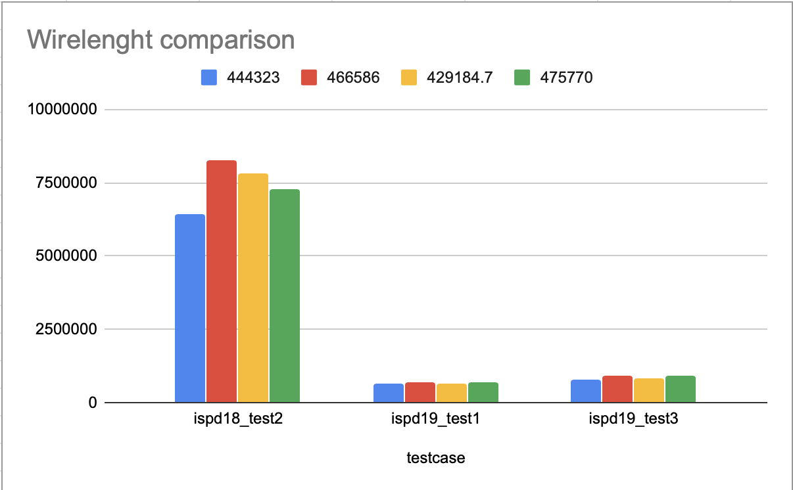
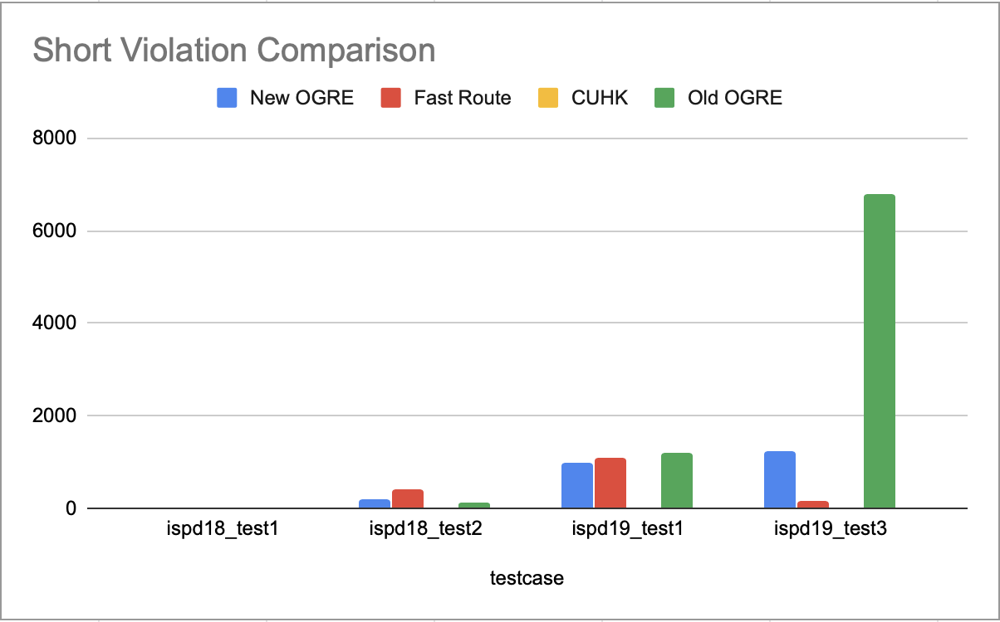
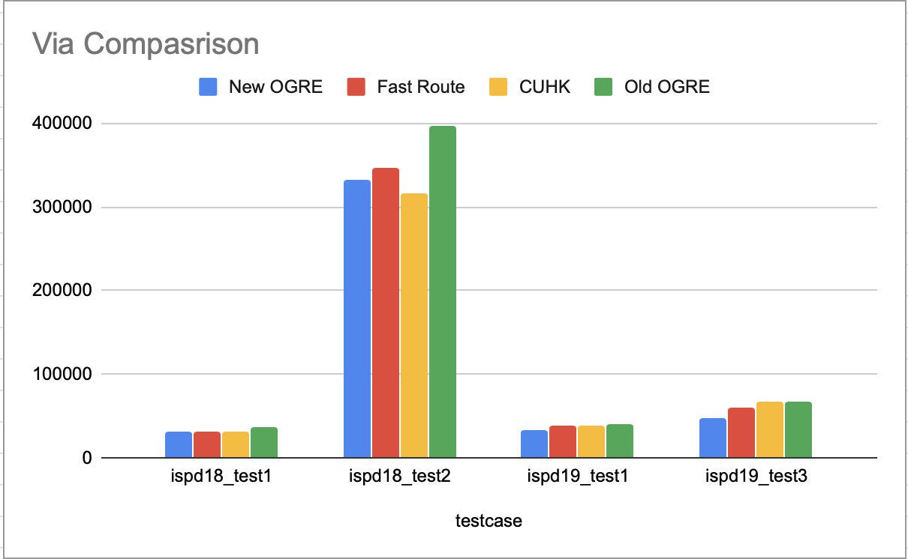
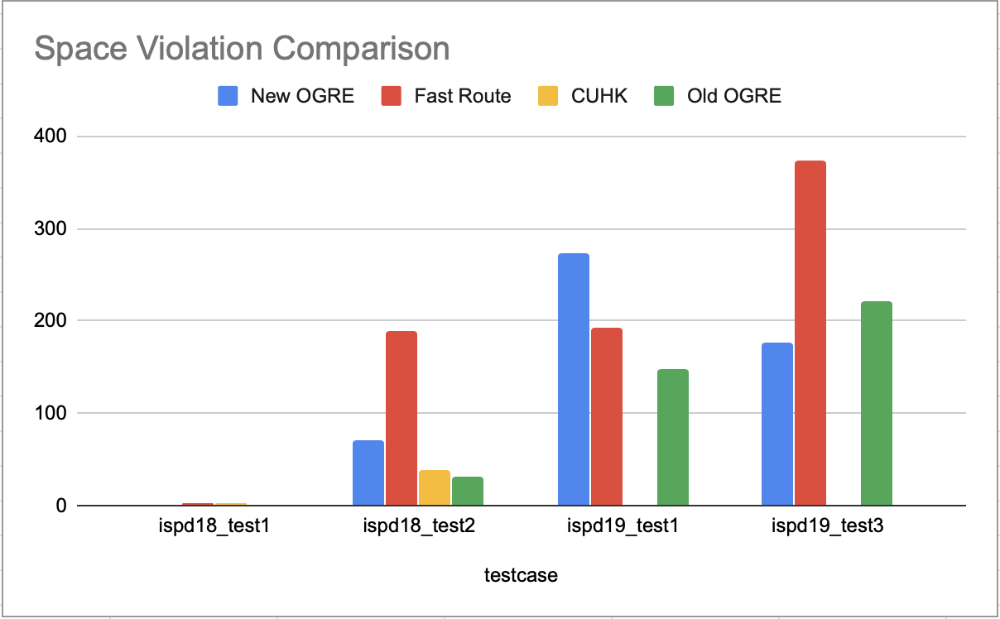
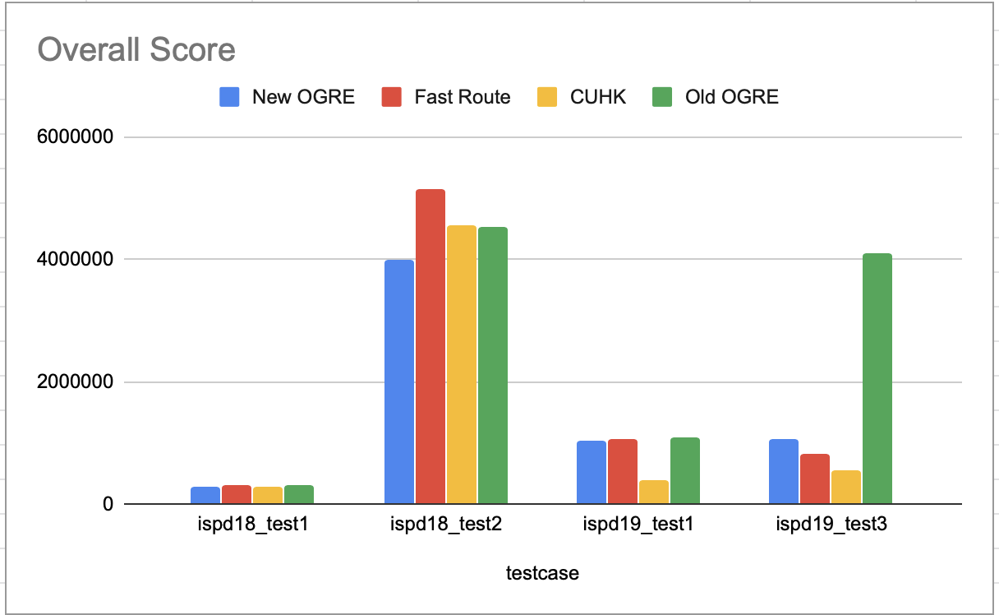
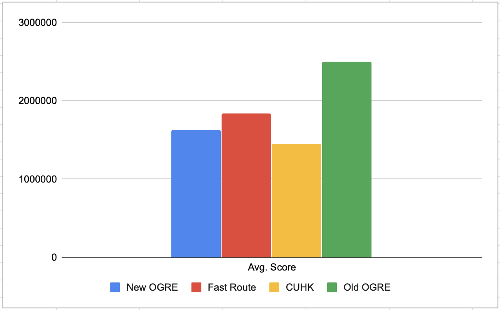

# Global Router Built for ICCAD-Contest 2019

This Global Router was built for ICCAD 2019 contest. VLSI circuit layout is when the physical circuit is figured out from two files: Library Exchange Format (LEF) and Design Exchange Format (DEF). Due to the size of the problem, and the increasing complexity, the problem is cut into phases, and in the global routing phase, the grid is created from a definition in the DEF file called the GCells. And then routing takes place giving a guide to the detailed router to flood in it; hence, decreasing the overall complexity.

# Table of Contents
* [Results](#results)
    * [Wirelength](#Wirelength)
    * [Short](#short)
    * [Vias](#Vias)
    * [Space](#Space)
* [Getting Started](#get-started)
     * [Prequisites](#prequisites)
     * [Installing](#installing)
* [Running Tests](#get-started)
* [Getting Started with OGRE](#getting-started-with-ogre)

     * [Outputs](#output)
     * [Building the  G-Cell Grid ](#building-g-cell-grid)
     * [Setting Capacitance](#setting-capacitance)
     * [Adding Obstructions](#adding-obstructions)
     * [Routing](#routing)
     
* [Authors](#step-2-detach-or-join-a-subflow)
* [Contributors](#contributors)

## Getting Started

These instructions will get you a copy of the project up and running on your local machine for development and testing purposes.

### Prequisites

What things you need to do to get the Lef Def Parser working
```shell
git clone https://github.com/fadymoh/Global-Router-ICCAD-Contest
cd Global-Router-ICCAD-Contest
cd si2
cd def
make clean
make install
cp /lib/libdef.a ../../GlobalRouter/lib/linux
cd ../lef
make clean
make install
cp /lib/liblef.a ../../GlobalRouter/lib/linux
```
### Installing

What you need to do to get the GlobalRouter Working.
First navigate to the Global Router directory.

```shell
make clean
make depend
make all
```

## Running the tests

```shell
./global_router -lef <lef file path> -def <def file path> -output <guide file path> -thread <number of threads> 
```

## Getting Started with OGRE

# Results

### Wirelength

| testcase | New OGRE | Fast Route | CUHK | Old OGRE |
| -------- | -------- | ---------- | ---- | -------- |
| ispd18_test1 | 444323 | 466586 | 429184.7 | 475770 |
| ispd18_test2 | 6423810 | 8276470 | 7801281.98 | 7287680 |
| ispd19_test1 | 653582 | 684564 | 641959.56 | 693784 |
| ispd19_test3 | 781311 | 896482 | 833475.12 | 910578 |



### Short

| testcase | New OGRE | Fast Route | CUHK | Old OGRE |
| -------- | -------- | ---------- | ---- | -------- |
| ispd18_test1 | 0.3325 | 5.41 | 0 | 0.3 |
| ispd18_test2 | 180.118 | 427.14 | 1.02 | 140.83 |
| ispd19_test1 | 981 | 1109 | 6.8 | 1186.5|
| ispd19_test3 | 1227.75 | 150.32| 23.71 | 6776.88 |



### Vias

| testcase | New OGRE | Fast Route | CUHK | Old OGRE |
| -------- | -------- | ---------- | ---- | -------- |
| ispd18_test1 | 31616 | 31976 | 31734 | 36563 |
| ispd18_test2 | 331909 | 346712 | 315968 | 396200 |
| ispd19_test1 | 33681 | 37599 | 38511 | 39363 |
| ispd19_test3 | 48130 | 59771 | 66603 | 67347 |



### Space

| testcase | New OGRE | Fast Route | CUHK | Old OGRE |
| -------- | -------- | ---------- | ---- | -------- |
| ispd18_test1 | 1 | 2 | 2 | 0 |
| ispd18_test2 | 71 | 189 | 38 | 32 |
| ispd19_test1 | 273 | 193 | 0 | 147 |
| ispd19_test3 | 176 | 373 | 0 | 222 |



### Overall

| testcase | New OGRE | Fast Route | CUHK | Old OGRE |
| -------- | -------- | ---------- | ---- | -------- |
| ispd18_test1 | 286060 | 300950 | 279060.35| 311161 |
| ispd18_test2 | 4001280 | 5139729 | 4552086.99 | 4522655 |
| ispd19_test1 | 1021150 | 1068480 | 401401.78 | 1092368 |
| ispd19_test3 | 1063760 | 829443 | 561798.56 | 4089423 |



### Avg. Score

| testcase | New OGRE | Fast Route | CUHK | Old OGRE |
| -------- | -------- | ---------- | ---- | -------- |
| ispd18_test1 | 1624320 | 1834650.5 | 1448586.92| 2503901.75 |



### Parsing 

The following example is from (main.cpp) shows the first part of the main function. This project is usually compiled from the terminal by giving it commands where we specify the input lef , and input def files, then we specify the file that we want the guide to be outputted in and then we specify the number of  threads, to specify any of the files we write the following commands : -lef "leffile" , -def "deffile",-output "filename", and -thread number. This project is tested with the testcases provided by the ICCAD-Contest 2019.  Then we validate the inputs if either the def, lef or the thread number  is not provided then we return as these three inputs are essential to run the router. We also parse and read the lef and def files provided.

```cpp
auto &ap = ArgParser::get();

ap.initialize(argc, argv);
auto filename_lef = ap.get_argument("-lef");
auto filename_def = ap.get_argument("-def");
auto outfile_guide = ap.get_argument("-output");
auto thread_count = ap.get_argument("-thread");
out.open(outfile_guide);
int threadsCounter = stoi(thread_count);
if (filename_lef == "" or filename_def == "" or outfile_guide == "" or thread_count == "")
{
show_usage();
return -1;
}
show_banner();
show_cmd_args();

ldp.read_lef(filename_lef);
ldp.read_def(filename_def);

```
### Outputs
 The functions show_usage(), show_banner() and show_cmd_args() that are shown above are used to show the user compiling the project the command he/she entered. 
 The function show_usage() as shown below shows the user the commands he/she entered .
```void show_usage()
{
cout << endl;
cout << "Usage:" << endl;
cout << "global_router -lef <lef> -def <def> -output <guide> -thread <# of threads>" << endl
<< endl;
}
```
The function show_banner() as shows the affliations.
```
void show_banner()
{
cout << endl;
cout << string(79, '=') << endl;
cout << "\t\t\tISPD - Global Routing Contest" << endl;
cout << "\t\tAuthors: Ali El-Said, Fady Mohamed, Habiba Gamal," << endl;
cout << "\t\tAhmed Fahmy, Aya Farag, Ahmed Ragab, Noha Abulfadle" << endl;
cout << "\t\tAffiliation: The American University in Cairo" << endl;
cout << string(79, '=') << endl;
}
```
The function show_cmd_args() shows  the lef and def files used.
```void show_cmd_args()
{
auto &ap = ArgParser::get();
auto filename_lef = ap.get_argument("-lef");
auto filename_def = ap.get_argument("-def");
cout << " LEF file : " << filename_lef << endl;
cout << " DEF file : " << filename_def << endl;
}
```
### Building the  G-Cell Grid 
After we've parsed the def and lef files we are ready to build the global grid.  Using ldp which is an instance of a lefdef parser [LefDefParser.cpp](./GlobalRouter/lefdef/LefDefParser.cpp), we build a 3D g-cell grid. The function ldp.build_Gcell_grid , returns a vector that contains the  gcell Grid and takes an unordered map called layerMap as an input ```unordered_map<int, lef::LayerPtr> layerMap```
If we go to  [LefDefParser.cpp](./GlobalRouter/lefdef/LefDefParser.cpp), we will find the function. The  function  below puts  its results in a 3D vector, one representing the x axis of the gird , the y axis and the z-axis which shows in which layer are we at that point.
```vector<vector<vector<my_lefdef::gCellGridGlobal>>> &LefDefParser::build_Gcell_grid(unordered_map<int, lef::LayerPtr> &layerMap)
```
Then we declare another vector called gCellGridVector which reads the gcell girds from the def file, and we define two sets, one for the x coordinates and the other for the y coordinates.
```
vector<def::GCellGridPtr> gCellGridVector = def_.get_gcell_grids();
set<int> xCoord;
set<int> yCoord;
```
After that we loop on the gCellGridVector and we check the direction of each point in  the gird, if the direction of it is x then we insert all the x coordinates into the xCoord other the point is on the  y-axis.
```
for (auto GcellGridItem : gCellGridVector)
{
if (GcellGridItem->direction_ == TrackDir::x)
for (int i = GcellGridItem->location_; i < GcellGridItem->location_ + GcellGridItem->num_ * GcellGridItem->step_; i = i + GcellGridItem->step_)
xCoord.insert(i);
else
for (int i = GcellGridItem->location_; i < GcellGridItem->location_ + GcellGridItem->num_ * GcellGridItem->step_; i = i + GcellGridItem->step_)
yCoord.insert(i);
}
```
Then we try to get the number of metal tracks from the def file. 
```
vector<def::TrackPtr> tracks = def_.get_tracks();
unordered_set<string> tracks_names;
```
Now we start creating a map of metal layer names , and  layer pointers. So we loop on the number of tracks we have, we get the names and insert it into an unordered_Set called tracks_names , and this is the name of each layer in the  gcellgrid, so it represents the z-coordinates.   So now we know the size of the gcell grid and all the coordinates.
```for (int i = 0; i < tracks.size(); i++)
{
string layerName = tracks[i]->layer_;
tracks_names.insert(layerName);
int l = layerName[layerName.length()-1] - '0';
layerMap[l] = lef_.get_layer(layerName);
}
int xDimension = xCoord.size();
int yDimension = yCoord.size();
int zDimension = tracks_names.size();
```
myGlobalGrid is a 1D vector, so we first of all resize it and we assume that  this is the layers vector, so its the  size of zDimensions, after that we loop on the whole grid and we create each layer, by defining an x and a y axis in  each layer for it to be 3D.


```myGlobalGrid.resize(zDimension);
for (int i = 0; i < zDimension; i++)
{
myGlobalGrid[i] = vector<vector<my_lefdef::gCellGridGlobal>>(xDimension - 1);
}
```
After we define the size of the whole grid, we get the coordinate points and size of each point  and we push add it to the corresponding layer.
```for (int i = 0; i < xDimension - 1; ++i)
{
auto it = xCoord.begin();
advance(it, i);
int firstMinX = *it;
++it;
int secondMinX = *it;
for (int j = 0; j < yDimension - 1; ++j)
{
auto itY = yCoord.begin();
advance(itY, j);
int firstMinY = *itY;
++itY;
int secondMinY = *itY;

for (int k = 0; k < zDimension; k++)
{
myGlobalGrid[k][i].push_back({{firstMinX, firstMinY}, {secondMinX, secondMinY}, (secondMinY - firstMinY) * (secondMinX - firstMinX)});
}
}
}
```
### Setting Capacitance
After creating the gcell grid and adding all the points, we create congestion based on  the available metal wires. We first get the pitch  of  each layer. A pitch is the minimum distance between two wires , and its a measurment of the distance from the middle point of the first wire to the middle point of the second  wire. We use this pitch to calculate the number of wires we can fit within that gcell. After that we calculate the capacity of that layer by  getting the area and dividing it by the pitch of the x axis by the y axis, and we set that as the new  capacity for that layer, and we set the maximum wire capacitance by multiplying the capacitance for the wires by 0.75 and vias 0.25 to give more priority to the vias.
```
for (int k = 0; k < zDimension; k++)
{
    for (int i = 0; i < xDimension - 1; ++i)
    {
        for (int j = 0; j < yDimension - 1; ++j)
        {
            lef::LayerPtr l = layerMap[k + 1];
            double pitch = layerMap[k + 1]->pitch_;
            double pitchX = layerMap[k + 1]->pitch_x_ * defDBU;
            double pitchY = layerMap[k + 1]->pitch_y_ * defDBU;
            int capacity = myGlobalGrid[k][i][j].area / (long long) (pitchX * pitchY);
            myGlobalGrid[k][i][j].setCapacity(capacity);
            myGlobalGrid[k][i][j].maxWire = capacity * 0.75;
            myGlobalGrid[k][i][j].maxVia = capacity * 0.25;
        }
    }
}
```
Now we have the grid with its sizes, wires, and capacitance, so the function returns this 3D vector grid to be used for routing.
```
myGlobalGrid.resize(zDimension);
for (int i = 0; i < zDimension; i++)
{
myGlobalGrid[i] = vector<vector<my_lefdef::gCellGridGlobal>>(xDimension - 1);
}
```
After having the global grid, we create an unordered map of nets and we read the nets from the def file and then insert it into the priority queue where it orderes the nets in terms of which pair have the largest distance between them. Then we start to put obstructions.
```
unordered_map<string, def::NetPtr> nets;
nets = ldp.def_.get_net_umap();
pq xx = orderNets(nets);
queue<pair<int, string>> ordered_nets;
for (int i = 0; i < xx.size(); i++)
{
pair<int, string> b = xx.top();
ordered_nets.push(b);
xx.pop();
}
```
### Adding Obstructions
To put the obstructions in the gcell, we read the obstructions from the def file into an unordered map called compMap, here we read the location of the obstruction by getting x and why coordinates and we also read the size of that obstructions in order to know where to put it and how big it will be.
```unordered_map<string, def::ComponentPtr> compMap = xldp.def_.get_component_umap();
```
After getting the locations of the obstructions, we  start reading  the unordered list and start placing them within the gcell. So at first we get the x,y,W,H coordinates, and the orientation of that obstruction. 

```for (auto &comp : compMap)
{
int x0 = comp.second->x_;
int y0 = comp.second->y_;
int W = comp.second->lef_macro_->size_x_ * defDBU;
int H = comp.second->lef_macro_->size_y_ * defDBU;
string orientation = comp.second->orient_str_;
```
The orientation can be North, Flipped North, South, Flipped South, West , Flipped West, East , and Flipped East. Accordingly we get the coordinate points of the obstruction and where it will be place. Like shown in the example below.
```
if (orientation == "N")
{
xl = x0 + x;
yl = y0 + y;
xh = xl + w;
yh = yl + h;
}
else if (orientation == "FN")
{
xl = x0 + W - x - w;
yl = y0 + y;
xh = xl + w;
yh = yl + h;
}
```
After getting the coordinate points of  the obstructions, we get the bounding gcell of these obstructions to know in which gcell will the obstuction be place. After getting the bouding cells, we get the points and pick the maximum space that the obstruction is located in to make sure it is bounded. 
```
pair<int, int> pMin;
pair<int, int> pMax;
pMin = xldp.get_bounding_GCell(xl, yl);
pMax = xldp.get_bounding_GCell(xh, yh);
pair<int, int> temp = pMin;
pMin = {min(pMin.first, pMax.first), min(pMin.second, pMax.second)};
pMax = {max(temp.first, pMax.first), max(temp.second, pMax.second)};
```
After that we set find the exact location of the obstruction in the gcell, and we check the utilization, which is how obstructed the gcell is.
```
double pitchX = layerMap[k]->pitch_x_ * defDBU;
double pitchY = layerMap[k]->pitch_y_ * defDBU;

double obstructionChangeInX = endX - startX;
double obstructionChangeInY = endY - startY;
double gcellChangeInX = gcellGrid[k - 1][i][j].endCoord.first - gcellGrid[k - 1][i][j].startCoord.first;
double gcellChangeInY = gcellGrid[k - 1][i][j].endCoord.second - gcellGrid[k - 1][i][j].startCoord.second;
 double utilization = (obstructionChangeInX * obstructionChangeInY) / (gcellChangeInX * gcellChangeInY);

```
After  we  find   every obstruction belongs to which g-cell,  based on where the obstructions are we decide the utilization factor of the cell.  Utilization is a measure of how congested the gcell is , therefore is the utilization rate is high we need more vias then wires, therefore we use a quadratic equation to calculate the via and wire capacitance based on change in the utilization, the higher the utilization the higher the via capacity and the lower the wire capacity.
```
int capacity = gcellGrid[k - 1][i][j].capacity * (1 - utilization);
gcellGrid[k - 1][i][j].setCapacity(capacity);
gcellGrid[k-1][i][j].setWireCap(capacity * 1- ((-2*pow(utilization,2))+2*utilization+0.25));
gcellGrid[k-1][i][j].setViaCap(capacity * ((-2*pow(utilization,2))+2*utilization+0.25));
```
### Routing
After we've put the obstructions, we are now ready to start routing.  We start looping on  the number of nets we have in  the gcell because they all need to be palced. Now we need to decompse the  net into two-pin subnets and to do that we use SALT, which reads the tree and decomposes it. Which its decomposing it a pair doesnt exist and there are no two-pins then the function returns false as it won't be able to route  without having both pins, so if the function returns false it sets a boolean variable "can run" to false. If its true it starts routing, so we find the source layer of  that net first, and then we call our function route to route the nets. 

```bool canRun = salt_net.read_net(net, net_id++, idMap);
salt::Tree salt_tree;
salt::SaltBuilder saltB;
if (canRun)
{
saltB.Run(salt_net, salt_tree, eps);
route_nodes.clear();
int source_layer;
if(idMap.find(salt_tree.source->id) != idMap.end()){
source_layer = idMap[salt_tree.source->id].second;
}
else{
source_layer = 0;
}
dfs(salt_tree.source, source_layer);
name = netName.second;
unordered_map<string, vector<triplet>> allNetsPathCopy;
vector<vector<vector<my_lefdef::gCellGridGlobal>>> gcellGridCopy;
gcellGridCopy = gcellGrid;
Route(false,name,threadsCounter,bufferId,allNetsPathCopy,gcellGridCopy);
}
```
The function Route takes a boolean variable to tell us if the net failed to be route or not, its name, the gcell grid and all the nets paths in order to know where its supposed to route. 

```
void Route(bool failed,string name,int threadsCounter,int&bufferId,unordered_map<string, vector<triplet>> &allNetsPathCopy, vector<vector<vector<my_lefdef::gCellGridGlobal>>> &gcellGridCopy)
```
Function route at first takes the coordinate points of the  starting point and the goal points, in order to know where it needs to route or where its supposed to go. After getting the coordinate points of the  start and end points we call routeTwoPoints to route them for us.

```
start.z = route_nodes[ii].first.z;
start.x = route_nodes[ii].first.x;
start.y = route_nodes[ii].first.y;
MapSearchNode goal;
goal.z = route_nodes[ii].second.z;
goal.x = route_nodes[ii].second.x;
goal.y = route_nodes[ii].second.y;
routeTwoPoints(start, goal, bufferId, name, failed);
```
routeTwoPoints at first checks that if the gcell that the  source or target are located in are 0, which means the cells are completely congested , if yes then we increase the capacitance  the wire and the vias, by 1 giving it space to be routed in, and  we set undoChanges to true.

```if (gcellGrid[source.z][source.x][source.y].capacity == 0 || gcellGrid[target.z][target.x][target.y].capacity == 0)
{

undoChanges = true;
int zz = gcellGrid.size();
int xx = gcellGrid[0].size();
int yy = gcellGrid[0][0].size();
for (int ziter = 0;ziter<zz;ziter++)
{
for (int xiter = 0 ;xiter<xx;xiter++)
{
for (int yiter = 0;yiter<yy;yiter++)
{
gcellGrid[ziter][xiter][yiter].setCapacity(gcellGrid[ziter][xiter][yiter].capacity+2);
gcellGrid[ziter][xiter][yiter].setWireCap(gcellGrid[ziter][xiter][yiter].maxWire+1);
gcellGrid[ziter][xiter][yiter].setViaCap(gcellGrid[ziter][xiter][yiter].maxVia+1);
}
}
}

}
```
After that we call Astar to route the source to the goal. At first the state of the net is searching, since A-star is searching for a place to route the net through.
```
AStarSearch<MapSearchNode> astarsearch(1000000);
astarsearch.SetStartAndGoalStates(source, target);
vector<triplet> threadResult;
unsigned int SearchState = AStarSearch<MapSearchNode>::SEARCH_STATE_SEARCHING;
unsigned int SearchSteps = 0;
```
We keep searching for a path and check the state every time, if it takes over 10000 iterations in order to find a pace to route the net, then the state of that net is failed, which means it failed to find a path to route the net. Otherwise it searchs as long as the state is searching.
```
do
{
SearchState = astarsearch.SearchStep();
SearchSteps++;
if (SearchSteps>10000)
{
SearchState = AStarSearch<MapSearchNode>::SEARCH_STATE_FAILED;
}

} while (SearchState == AStarSearch<MapSearchNode>::SEARCH_STATE_SEARCHING);
```
After it exits the while loop we check if the state is succeeded, if yes, what we  do  is check all the cells that A-Star has passed in and then we increment the utilization of Gcells by incrementing usedwires if its in the same layer, or incrementing vias if its in another layer.
```
if (SearchState == AStarSearch<MapSearchNode>::SEARCH_STATE_SUCCEEDED)
{
do
{
MapSearchNode *parentNode = node;
node = astarsearch.GetSolutionNext();
if (!node)
break;
count = 0;
for (int addition = node->z + 1; addition >= node->z - 1; --addition)
{
if (addition < 0 || addition >= zDimension || count >= 2)
continue;
threadResult.push_back({addition, node->x, node->y});

++count;
}

//
// ─── Increment utilization of Gcell ───────────────────────────────────────────────
//
if (parentNode->z == node->z)
gcellGrid[node->z][node->x][node->y].usedWires += 1;
else
gcellGrid[node->z][node->x][node->y].usedVias += 1;

} while (!failed);

```
After we've routed the net,  we go to the if statement below, and we decrease all the capacitance that we've added and we haven't routed , since we added 1 wire and one via to each cell. If adding only one  slot was not enough to get the net to route, then we continue adding slots until it doesnt fail. Then we remove all the slots added if the wire did not pass through it. 
```if (undoChanges)
{
    undoChanges = false;
    int zz = gcellGrid.size();
    int xx = gcellGrid[0].size();
    int yy = gcellGrid[0][0].size();
    for (int ziter = 0;ziter<zz;ziter++)
    {
    for (int xiter = 0 ;xiter<xx;xiter++)
    {
    for (int yiter = 0;yiter<yy;yiter++)
    {
    gcellGrid[ziter][xiter][yiter].setCapacity(gcellGrid[ziter][xiter][yiter].capacity-2*trials);
    gcellGrid[ziter][xiter][yiter].setWireCap(gcellGrid[ziter][xiter][yiter].maxWire-1*trials);
    gcellGrid[ziter][xiter][yiter].setViaCap(gcellGrid[ziter][xiter][yiter].maxVia-1*trials);
    if (gcellGrid[ziter][xiter][yiter].capacity<0)
    gcellGrid[ziter][xiter][yiter].setCapacity(0);
    if (gcellGrid[ziter][xiter][yiter].maxWire<0)
    gcellGrid[ziter][xiter][yiter].setWireCap(0);
    if (gcellGrid[ziter][xiter][yiter].maxVia<0)
    gcellGrid[ziter][xiter][yiter].setViaCap(0);
}
```
If search state is still failing,  then we add a wire and a via and we continue adding until the net can be routed, and we return  from routeTwoPoints.
```else if (SearchState == AStarSearch<MapSearchNode>::SEARCH_STATE_FAILED)
{
cout << "Search terminated. will reroute\n";

undoChanges = true;
int zz = gcellGrid.size();
int xx = gcellGrid[0].size();
int yy = gcellGrid[0][0].size();
for (int ziter = 0;ziter<zz;ziter++)
{
for (int xiter = 0 ;xiter<xx;xiter++)
{
for (int yiter = 0;yiter<yy;yiter++)
{
gcellGrid[ziter][xiter][yiter].setCapacity(gcellGrid[ziter][xiter][yiter].capacity+2);
gcellGrid[ziter][xiter][yiter].setWireCap(gcellGrid[ziter][xiter][yiter].maxWire+1);
gcellGrid[ziter][xiter][yiter].setViaCap(gcellGrid[ziter][xiter][yiter].maxVia+1);
}
}
}
trials+=1;
goto REROUTE;
}
```
If RouteTwoPoints fails to route, it will set failed to true, and then we will take the failed net and put it on top of the queue for it to be the first point to be routed which then will not fail. Route is a recursive  function and it will keep recursing until the nets no longer fail, and it succeeds routing all nets.
```if (failed)
{
gcellGrid = gcellGridCopy;
allNetsPath.clear();
route_nodes.insert(route_nodes.begin(),route_nodes[ii]);
route_nodes.erase(route_nodes.begin()+ii+1);
failed = false;
Route(failed,name,threadsCounter,bufferId,allNetsPathCopy,gcellGridCopy);
return;
}
```
### Main functions
The table below summarizes a  list of the mainly used methods.

| Method |  Argument |Return |  Description |
| ------ |  ------- | ------ |  ----------- | 
| putObstructions| none | void | Adds obstructions to the g-cell |
| routeTwoPoints | source,target,id,name,failed | void | takes a source point and a target  and attempts to route them |
| Route | failed,name,threadsCounter,bufferId,allNetsPathCopy,gcellGridCopy | void | recurssive function that attempts to route two points |

### Main Classes Used
The folder `GlobalRouter/` contains all the main classes used in this project.

| Example |  Description |
| ------- |  ----------- | 
| [LefDefParser.cpp](./GlobalRouter/lefdef/LefDefParser.cpp) | Parses and reads the lef def files provided |
| [ArgParser.cpp](./GlobalRouter/util/ArgParser.cpp)| Parses the provided  arguments |
| [salt.cpp](./GlobalRouter/lefdef/salt.cpp)| Decomposes nets into subnets |
| [MapSearchNode.cpp](./GlobalRouter/util/MapSearchNode)| Searches for the states of each node, and the distance between source and distance |
| [ThreadPool.cpp](./GlobalRouter/util/ThreadPool)| Includes the threads used and which functionalities to perform |


## Authors

* **Ali El-Said** [palindali](https://github.com/palindali)
* **Fady Mohamed** [fadymoh](https://github.com/fadymoh)
* **Habiba Gamal** [habibagamal](https://github.com/habibagamal)
* **Aya Farag** [ayashaker98](https://github.com/ayashaker98)
* **Noha  Mohamed** [noha158](https://github.com/noha158)
* **Ahmed Fahmy** [awael](https://github.com/awael)
* **Ahmed Abouzaid** [AhmedAbouzaid1](https://github.com/AhmedAbouzaid1)
## Acknowledgments

* Doctor Mohamed Shalan was our advisor for the contest.
* Lef Def parser's author is [jinwookjungs](https://github.com/jinwookjungs)
* Fast Implementation of A star algorithm in 2D [justinhj](https://github.com/justinhj/astar-algorithm-cpp)
* FLUTE: Fast Lookup Table Based Technique for RSMT Construction and Wirelength Estimation (http://home.eng.iastate.edu/~cnchu/flute.html)
* SALT: Steiner Shallow-Light Tree for VLSI Routing. (https://github.com/chengengjie/salt)
